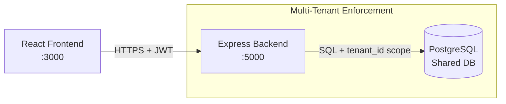
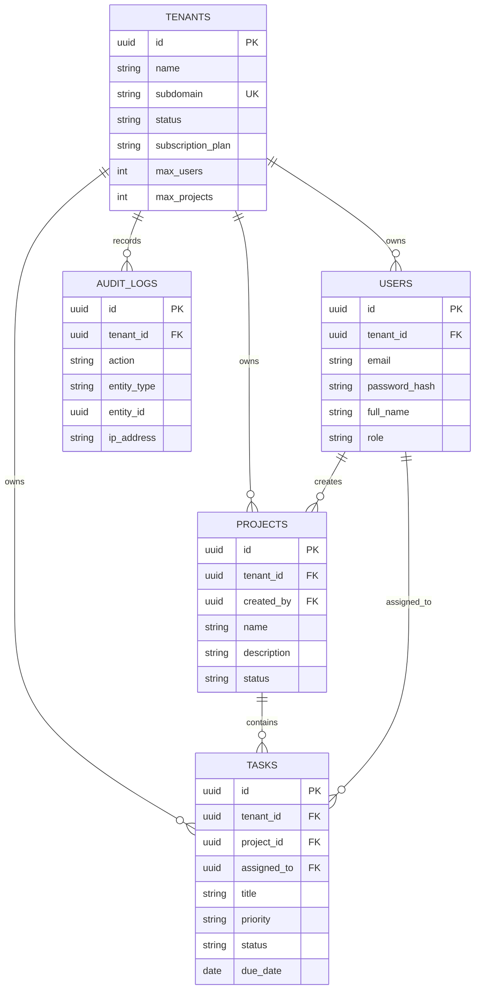

# System Architecture Document

**Project Name:** Multi-Tenant SaaS Project Management System  
**Version:** 1.0  
**Document Status:** Approved  
**Author:** Lead Developer  
**Last Updated:** October 26, 2025  

---

## 1️. Overview

The system adopts a **containerized three-tier web architecture** optimized for scalability, performance, and strict tenant isolation.  
All components run in isolated Docker containers and communicate securely within a private Docker network, ensuring consistent deployments across environments.

Key architectural traits:
- Modular separation of concerns
- Stateless backend
- Secure authentication and authorization
- Logical tenant isolation
- Production-ready deployment model

---

## 2. Architecture Style

This system follows a **multi-tenant SaaS architecture** with a clear layering pattern:

- **Client Layer (Presentation)**
- **Application Layer (Business Logic & APIs)**
- **Data Layer (Persistent Storage)**

Tenant isolation is enforced across application logic and database level using `tenant_id`.

---

## 3. Component Architecture

---

### Client Layer — Frontend

- **Technology:** React (Vite)
- **Container Port:** `3000 → 3000`
- **Responsibilities**
  - UI rendering
  - User interaction management
  - JWT based session handling
  - API communication

- **Tenant Context Handling**
  - Subdomain-based identification (pattern: `<tenant>.app.com`) OR
  - Explicit tenant selection at login

---

### Application Layer — Backend API

- **Technology:** Node.js + Express
- **Container Port:** `5000 → 5000`

**Core Responsibilities**
- Authentication (JWT)
- Authorization (RBAC)
- Business logic execution
- Tenant isolation validation

**Isolation Strategy**
- Middleware extracts `tenant_id` from JWT
- Injected into request context
- Applied consistently in DB queries

This ensures **no cross-tenant access** under any scenario.

---

### Data Layer — Database

- **Technology:** PostgreSQL 15
- **Container Port:** `5432 → 5432`

**Responsibilities**
- Persistent relational data storage
- Transaction integrity
- Query performance

**Multi-Tenancy Strategy**
- Shared Database
- Shared Schema
- Logical isolation using `tenant_id`

Every tenant-owned entity contains:
```
tenant_id (UUID)
```

This enforces **strong logical partitioning**.

---

## 4. System View (Architecture Summary)



---

## 5. Database Architecture (ERD)

The schema is normalized to **3rd Normal Form (3NF)**.  
`tenant_id` acts as the **logical partition key**.



---

## 6. Schema Rules & Constraints

### Tenants
- Unique subdomain
- Subscription tracking
- Plan limits (`max_users`, `max_projects`)

### Users
- Scoped uniqueness:
```
UNIQUE(tenant_id, email)
```
- Secure password hashing
- Role based access enforced

### Projects
- Tenant-scoped
- Cascade delete behavior
- Indexed for performance

```sql
CREATE INDEX idx_projects_tenant 
ON projects(tenant_id);
```

### Tasks
- Bound to project + tenant
- Optional assignee
- Indexed for faster lookup

```sql
CREATE INDEX idx_tasks_tenant 
ON tasks(tenant_id);
```

### Audit Logs
- Tracks system actions
- Helps debugging and audits

---

## 8️. API Architecture

The backend exposes REST APIs following **consistent conventions**, secure authorization, and strict tenant scoping.

### Standard API Response Format

```json
{
  "success": true,
  "message": "Operation completed successfully",
  "data": {}
}
```

---

## 9️. API Modules

### Authentication
- Register Tenant
- Login
- Get Profile
- Logout

### Tenant Management
- View tenants
- Get tenant details
- Update tenant

### User Management
- Create user
- List users
- Update user
- Delete user

### Project Management
- Create
- List
- Update
- Delete

### Task Management
- Create
- List
- Update Status
- Full Update

---

## Summary

This architecture ensures:
- High scalability
- Strong tenant isolation
- Secure authentication
- Flexible future enhancements
- Production-ready deployment pipeline

---
