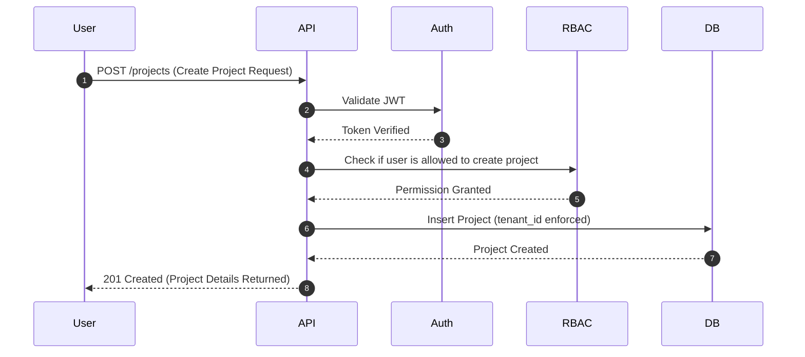

# Research Study: Architecture Strategy for a Multi-Tenant SaaS Platform

**Platform:** Multi-Tenant SaaS Project Management System  
**Prepared By:** Lead Architect  
**Approval Status:** Ready for Implementation  
**Last Revision:** October 26, 2025  

---

## Executive Overview

A successful SaaS platform must securely and efficiently serve multiple independent organizations (tenants) from a single system.  
Therefore, the **core architectural decision centers on multi-tenant database design**, as it impacts:

- Security & compliance
- Cost efficiency
- Operational complexity
- Scale behavior
- Developer velocity

This research explores multiple architectural alternatives, evaluates their trade-offs, and presents a justified final selection.

---

# 1. Evaluating Multi-Tenancy Database Models

Three mainstream architectural strategies were studied to determine the most suitable approach for this platform.

---

## Option A — Shared Database + Shared Schema  
*(Discriminator Column Strategy)*

**Concept Summary**  
All tenants share one database and one schema. Tenant isolation is enforced logically using a dedicated column such as `tenant_id`.

**How It Works**
- Each tenant-owned table includes `tenant_id`
- Queries always scope data:
  ```
  WHERE tenant_id = ?
  ```
- Enforcement handled at application middleware level

**Strength Areas**
- Minimal hosting cost
- Instant tenant onboarding
- Simple DevOps lifecycle
- Enables unified reporting

**Risk Areas**
- Any missing `tenant_id` in queries may cause leaks
- Per-tenant backup not straightforward
- Possible noisy-neighbor performance impact

---

## Option B — Shared Database + Separate Schemas  
*(Schema-Per-Tenant)*

**Concept Summary**  
One database; each tenant assigned its own schema.

**How It Works**
- Schema per tenant (ex: `tenant_a.users`)
- Runtime dynamically switches execution schema

**Strength Areas**
- Stronger isolation vs shared schema
- Easier tenant exports/backups
- Customization capability

**Risk Areas**
- Migration complexity grows rapidly
- Database metadata bloat
- Releases slower at scale

---

## Option C — Independent Database Per Tenant  
*(Silo Model)*

**Concept Summary**  
Each tenant receives a dedicated database instance.

**How It Works**
- Router maps tenant → database connection

**Strength Areas**
- Maximum isolation
- Zero noisy-neighbor effects
- Suitable for highly regulated industries

**Risk Areas**
- Highest cost
- Most DevOps effort
- Slowest onboarding
- Harder system-wide analytics

---

# 2️. Comparative Evaluation

| Evaluation Factor | Shared Schema | Separate Schema | Separate DB |
|------------------|--------------|-----------------|-------------|
| Security Isolation | Low | Medium | Very High |
| Cost Efficiency | Excellent | Good | Poor |
| Tenant Onboarding | Instant | Fast | Slow |
| DevOps Overhead | Minimal | Moderate | Heavy |
| Risk of Data Leak | Higher | Reduced | Minimal |
| Maintenance Complexity | Low | High | Very High |
| Scalability Direction | Vertical | Vertical | Horizontal |

---

# 3️. Final Architectural Decision

### **Selected Model**
### ➝ Shared Database + Shared Schema

---

## Why This Model Was Chosen

### Perfect Fit for Product Phase (MVP → Growth)
Focuses engineering effort on business value instead of infrastructure overhead.

### Aligned with Prisma ORM Strength
Works naturally with discriminator-based isolation strategies.

### Deployment Friendly
Seamlessly fits containerized (`docker-compose`) deployment philosophy.

### Risk-Controlled
Mitigation approach:
- Central middleware injects `tenant_id`
- Prevents developer slip-ups
- Ensures consistent isolation rules

---

# 4️. Technology Strategy Rationale

---

## Backend Layer — Node.js + Express
**Benefits**
- High concurrency
- Lightweight and fast
- Middleware architecture ideal for tenant enforcement

**Alternatives Rejected**
- Django → synchronous, rigid ORM
- Spring Boot → heavy and complex for MVP

---

## Frontend Layer — React + Vite
**Benefits**
- Modern SPA experience
- High performance builds
- Mature ecosystem

**Alternative Rejected**
- Angular → larger learning and architecture overhead

---

## Database Layer — PostgreSQL
**Benefits**
- Strong relational guarantees
- Transaction integrity
- Cascade operations
- JSONB hybrid flexibility
- Future-ready for Row Level Security

**Alternative Rejected**
- MongoDB → inadequate relational discipline

---

## Authentication Strategy — JWT
**Benefits**
- Stateless scalability
- Subdomain compatibility
- No centralized session storage

**Alternative Rejected**
- Server-managed sessions (Redis dependency)

---

## Deployment Strategy — Docker + Compose
**Benefits**
- Consistent environments
- Simple networking
- One-command lifecycle

---

# 5️. Security & Compliance Strategy

---

## Tenant Isolation Control
- Every API request validated
- JWT decoded
- System injects trusted tenant id
- Client input never trusted

---

## Credential Protection
- Bcrypt hashing
- Secure salt rounds standard
- Prevents rainbow-table attacks

---

## RBAC Security Model

| Role | Access Scope |
|------|--------------|
| Super Admin | Global system |
| Tenant Admin | Organization workspace |
| User | Restricted operational access |

Execution is **blocked before DB processing**, ensuring least-privilege enforcement.

---

## API Protection Measures
- Strict CORS
- Login rate limiting
- Security headers

---

## Validation & Query Defense
- Strong payload validation
- Prisma parameterized queries
- SQL injection safe

---

# 6️. Tenant Data Isolation Enforcement Pattern

```sql
SELECT *
FROM tasks
WHERE id = :taskId
AND tenant_id = :jwtTenantId;
```

If the tenant does not match → system responds:
```
404 Not Found
```

Result: zero visibility of foreign tenant data.

---

# 7️. Identity & Authorization Flow — Conceptual Summary

1️. User logs in  
2️. Tenant verified  
3️. JWT issued containing:
```
userId
tenantId
role
```
4️. Client attaches JWT per request  
5️. Authentication middleware validates token  
6️. RBAC verifies access  
7️. Database executes tenant-scoped query

---

## Interaction Flow Diagram



---

# Final Research Conclusion

The research confirms:

-  The **Shared Database + Shared Schema** model is optimal for current lifecycle
-  Provides best balance of cost, agility, and performance
-  Security risks are controllable via middleware enforcement
-  Platform remains future scalable

Therefore:

> **Proceed with selected architecture and implementation strategy**
